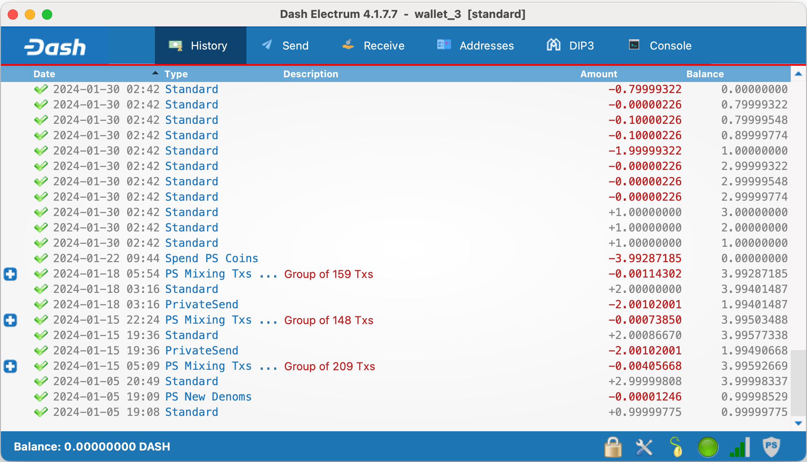

Dash Electrum - Lightweight Dash wallet (4.1.7.7)
=====================================

::

  Licence: MIT Licence
  Author: Mikhail Pshenichnikov
  Language: Python (>= 3.10)
  Homepage: https://dash-electrum.org/

Downloading binary
~~~~~~~~~~~~~~~

Head over to the `Releases <https://github.com/pshenmic/electrum-dash>`_ section and download latest stable release according your system architecture.

Verifying release
~~~~~~~~~~~~~~~

Download .asc signature file and place it in the same folder with your downloaded binary, then execute:

::

    gpg --verify Dash-Electrum-4.1.7.7-macosx.dmg.asc Dash-Electrum-4.1.7.7-macosx.dmg

Alternatively, you can verify SHA256CHECKSUMS file, and compare the integrity of your binary file via sha256sum command

::

    echo "<sha256sum> Dash-Electrum-4.1.7.7-macosx.dmg" | sha256sum -c

Installing
~~~~~~~~~~~~~~~

Head over to the `Releases <https://github.com/pshenmic/electrum-dash>`_ section and download latest stable release according your system architecture.

Using Tor proxy
~~~~~~~~~~~~~~~

Starting from Dash Electrum release 3.2.3.1 automatic Tor Proxy
detection and use on wallet startup is added to
`Network <docs/tor/tor-proxy-on-startup.md>`_ preferences.

To use Tor Proxy on Ubuntu set it up with::

    sudo apt-get install tor
    sudo service tor start

Other platforms setup is described at `docs/tor.md <docs/tor.md>`_

Building Dash Electrum executables
~~~~~~~~~~~~~~~

Building Electrum Dash happens on the CI (Github Actions) and all necessary commands for building can be seen in the ./github/workflows/build_release.yml workflow file.

This topic is also described here, but it might be slightly outdated: `docs/building-executables.md <docs/building-executables.md>`_

Development version
~~~~~~~~~~~~~~~

Running development version is a bit complicated and will be described later
